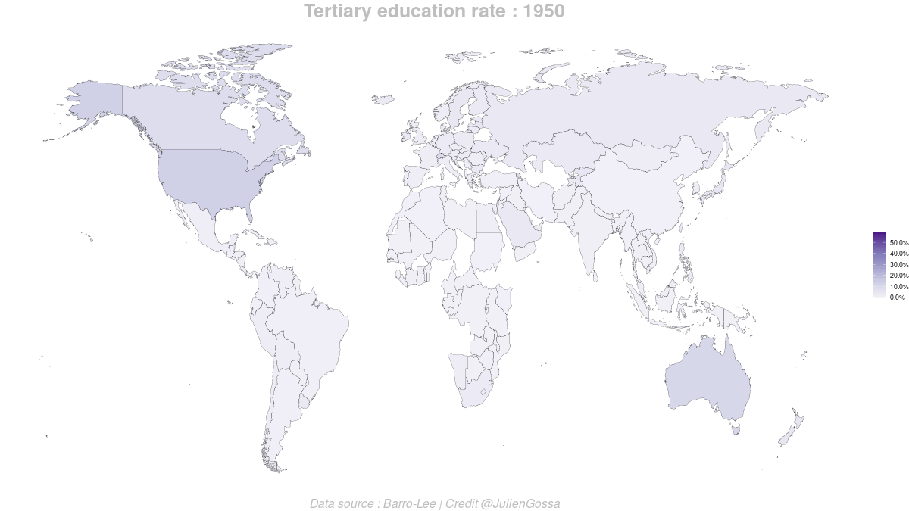

```{r setup, include=FALSE}
knitr::opts_chunk$set(echo = FALSE)
knitr::opts_chunk$set(include = TRUE)

library(tidyverse)
library(ggplot2)
library(ggbeeswarm)
library(ggthemes)
library(maps)
library(gganimate)
```

Barro, Robert and Jong-Wha Lee, 2013, “A New Data Set of Educational Attainment in the World, 1950-2010.” Journal of Development Economics, vol 104, pp.184-198.
http://www.barrolee.com/

```{r load}
bl <- bind_rows(
  read.csv("../BLData/BL2013_M2599_v2.2.csv") %>% mutate(sex = as.character(sex)),
  read.csv("../BLData/BL2013_F2599_v2.2.csv") %>% mutate(sex = "F"),
  read.csv("../BLData/BL2013_MF2599_v2.2.csv") %>% mutate(sex = as.character(sex)),
  read.csv("../BLData/BL2013_M1599_v2.2.csv") %>% mutate(sex = as.character(sex)),
  read.csv("../BLData/BL2013_F1599_v2.2.csv") %>% mutate(sex = "F"),
  read.csv("../BLData/BL2013_MF1599_v2.2.csv") %>% mutate(sex = as.character(sex))) %>%
  mutate(
    year = as.factor(year),
    sex = as.factor(sex)) %>%
  mutate_at(vars(lu:lhc), function(x) x/100)

bl2map <- read.csv("bl2map.csv")
bl2mapv <- as.character(bl2map$bl.name)
names(bl2mapv) <- bl2map$map.name

bl_map_data <- map_data("world") %>%
  mutate(
    region = case_when(
      subregion == "Macao" ~ "Macao",
      subregion == "Hong Kong" ~ "Hong Kong",
      TRUE ~ region
    )) %>%
  mutate(
    country = recode(region, !!!bl2mapv)
  )
```

## Education race 





```{r educrace.area.rate, fig.width=9, fig.height=6} 

countries <- c("USA","China","United Kingdom","Germany","France","Republic of Korea")

levelsPaletteP <- RColorBrewer::brewer.pal(8,"Paired")[c(2,1,4,3,8,7,5)]
levelsPalette <- rev(RColorBrewer::brewer.pal(8,"Purples"))

bl.area <- bl %>% filter(agefrom == 15, sex %in% c("MF")) %>%
  group_by(year) %>% 
  filter(country %in% countries) %>%
  mutate(
    lp = lp-lpc,
    ls = ls-lsc,
    lh = lh-lhc
  ) %>%
  mutate(
    country = recode(country, "United Kingdom" = "UK", "Republic of Korea" = "South Korea")) %>%
  mutate(
    country = factor(country, levels=c("USA","UK","Germany","France","South Korea","China")),
    ) %>% 
  mutate(country = fct_rev(country)) %>%
  select(country, year, pop, lu:lhc) %>%
  pivot_longer(cols = lu:lhc, names_to="level", values_to="value") %>%
  mutate(level = factor(level, levels=rev(c("lu","lp","lpc","ls","lsc","lh","lhc")))) %>%
  mutate(value.pop = value*pop / 1000)


bl.area %>% 
  ggplot(aes(x=year,y=value,colour=level,fill=level,group=level)) + geom_area(alpha=0.9) +
    facet_grid(country ~ .) +
    scale_y_continuous(labels = scales::percent) +
    scale_fill_manual(values=levelsPalette, labels=rev(c("Aucun","Primaire","Primaire complet","Secondaire","Secondaire complet","Supérieur","Supérieur complet"))) +
    scale_colour_manual(values=levelsPalette, labels=rev(c("Aucun","Primaire","Primaire complet","Secondaire","Secondaire complet","Supérieur","Supérieur complet"))) +
    #scale_y_continuous(labels = scales::percent) +
    theme_excel_new() +
  ggtitle("Pourcentage de la population âgée d'au moins 25 ans par niveau d'éducation.")
```

```{r educrace.area.abs, fig.width=9, fig.height=6} 

bl.area %>% 
  ggplot(aes(x=year,y=value.pop,colour=level,fill=level,group=level)) + geom_area(alpha=0.9) +
    facet_grid(country ~ .) +
    #scale_y_continuous(labels = scales::percent) +
    scale_fill_manual(values=levelsPalette, labels=rev(c("Aucun","Primaire","Primaire complet","Secondaire","Secondaire complet","Supérieur","Supérieur complet"))) +
    scale_colour_manual(values=levelsPalette, labels=rev(c("Aucun","Primaire","Primaire complet","Secondaire","Secondaire complet","Supérieur","Supérieur complet"))) +
    theme_excel_new() +
  ggtitle("Taille de la population (en millions) âgée d'au moins 25 ans par niveau d'éducation.")
```


## Massification et stagnation éducative


```{r global.data}
bl.global <- bl %>%
  filter(agefrom == 15, sex %in% c("MF")) %>%
  group_by(year) %>%
  summarise(
    pop.lhc = sum(lhc * pop),
    pop = sum(pop),
    lhc = pop.lhc / pop)
```

```{r global.taux}
ggplot(bl.global, aes(x=year,y=lhc)) + 
  # geom_col(, position="dodge") +
  geom_line(aes(group=1), size=2) +
  scale_y_continuous(labels = scales::percent, limits = c(0,0.08)) +
  theme_hc()
```

```{r global.taux2}
bl %>%
  filter(agefrom == 15, sex %in% c("MF")) %>%
ggplot(aes(x=year,y=lhc)) + 
  # geom_col(, position="dodge") +
  geom_boxplot(fill="purple") +
  scale_y_continuous(labels = scales::percent) +
  theme_hc()
```

```{r global.map}
bl %>% filter(agefrom == 15, sex %in% c("MF")) %>%
  filter(year==2010) %>%
right_join(bl_map_data) %>% 
  ggplot(aes(x = long, y = lat, group = group, fill = lhc)) +
    geom_polygon(colour = "black", size=0.1) +
    scale_fill_distiller(palette="Purples", na.value = "white", direction=1, labels = scales::percent) +
    theme_void()
```


```{r global.abs}
  ggplot(bl.global, aes(x=year,y=pop.lhc)) + 
  # geom_col(, position="dodge") +
  geom_line(aes(group=1), size=2) +
  scale_y_continuous(labels = function(x) paste0(x/1000," M")) +
  theme_hc()
```

## Taux d'éducation supérieure complète des femmes et des hommes, dans la population agée de plus de 15 ans, tous pays confondus.

```{r FM.global}
bl %>%
  filter(agefrom == 15, sex %in% c("M","F")) %>%
  group_by(year,sex) %>%
  summarise(
    pop.lhc = sum(lhc * pop),
    pop = sum(pop),
    lhc = pop.lhc / pop) %>%
  ggplot(aes(x=year,y=lhc, fill=sex)) + 
  # geom_col(, position="dodge") +
  geom_line(aes(colour=sex, group=sex), size=2) +
  theme_hc()
```


## Distribution des taux d'éducation supérieure complète des femmes et des hommes dans la population agée de plus de 15 ans, par pays.

```{r FM.distribution}
bl %>%
  filter(agefrom == 15, sex %in% c("M","F")) %>%
  ggplot(aes(x=year, y=lhc, fill=sex)) + geom_boxplot() + 
    theme_hc()
```


## Distribution des différence des taux d'éducation supérieure complète des femmes et des hommes dans la population agée de plus de 15 ans, par pays.

```{r diff.distribution}
bl %>%
  filter(agefrom == 15, sex %in% c("M","F")) %>%
  select(country, year, sex, lhc) %>% 
  pivot_wider(values_from = lhc, names_from = sex) %>%
  mutate(diff = F-M) %>%
  ggplot(aes(x=year, y=diff)) + geom_boxplot() + 
    theme_hc()
```


## Distribution des différence des taux d'éducation supérieure complète des femmes et des hommes dans la population agée de plus de 15 ans, par pays.

```{r diff.region}
bl.diff <- bl %>%
  filter(agefrom == 15, sex %in% c("M","F"), year==max(levels(year))) %>%
  select(country, region_code, year, sex, lhc) %>% 
  pivot_wider(values_from = lhc, names_from = sex) %>%
  mutate(
    diff.abs = F-M,
    diff.rel = (F-M)/M)

bl.diff %>%
  ggplot(aes(x=reorder(region_code, diff.rel), y=diff.rel, fill=region_code)) + geom_boxplot() + 
  coord_flip() +
    theme_hc()
```


```{r diff.map}
bl_map_data %>%
  left_join(bl.diff) %>% 
  ggplot(aes(x = long, y = lat, group = group, fill = diff.abs)) +
    geom_polygon(colour = "gray90") +
    scale_fill_distiller(palette="RdYlBu", limits=c(-0.12,0.12), na.value = "white") +
    theme_void()
```


