Exploitation de la base BarroLee
================
Julien Gossa
26/08/2020

Barro, Robert and Jong-Wha Lee, 2013, “A New Data Set of Educational
Attainment in the World, 1950-2010.” Journal of Development Economics,
vol 104, pp.184-198. <http://www.barrolee.com/>

## Education race

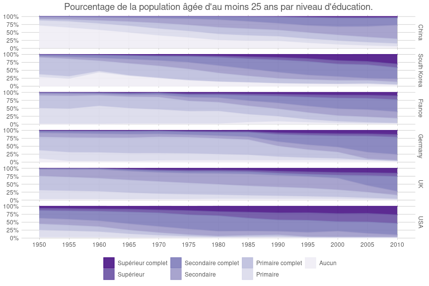<!-- -->

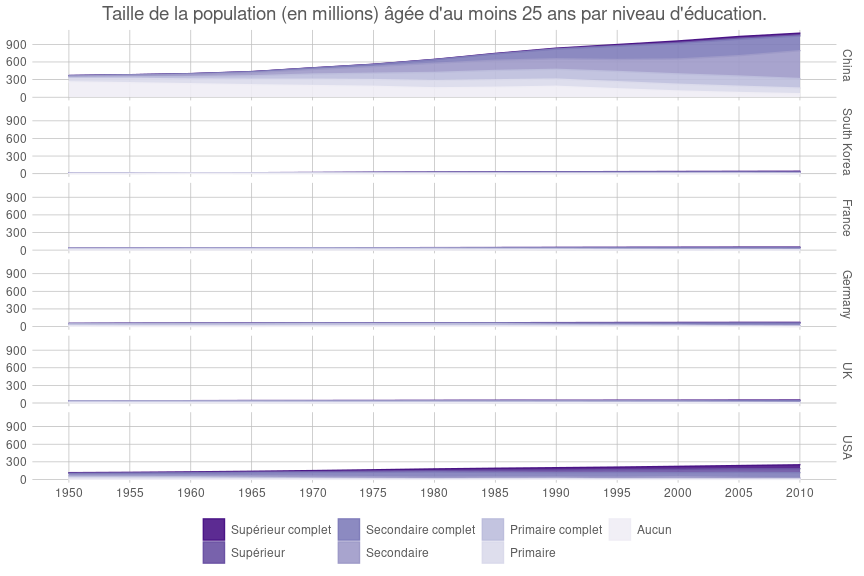<!-- -->

## Massification et stagnation éducative

    ## `summarise()` ungrouping output (override with `.groups` argument)

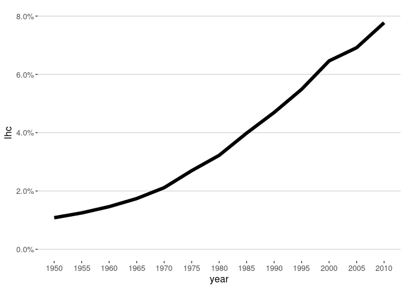<!-- -->

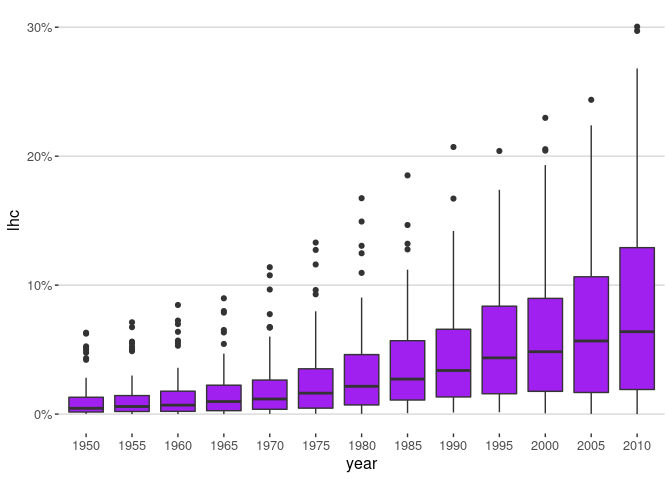<!-- -->

    ## Joining, by = "country"

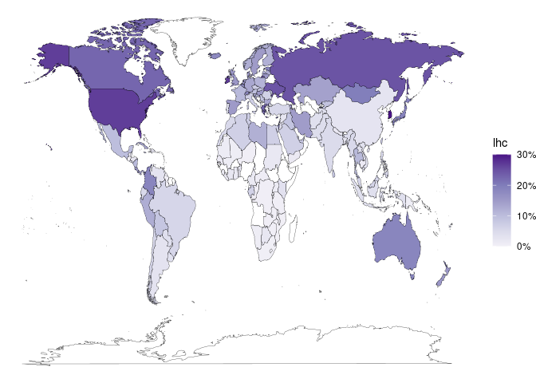<!-- -->

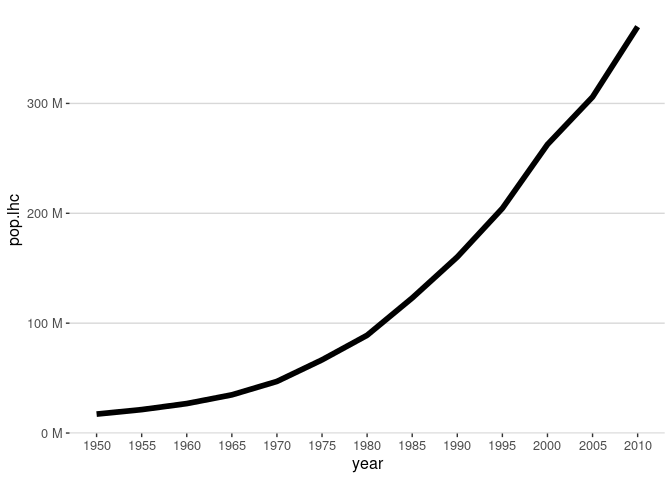<!-- -->

## Taux d’éducation supérieure complète des femmes et des hommes, dans la population agée de plus de 15 ans, tous pays confondus.

    ## `summarise()` regrouping output by 'year' (override with `.groups` argument)

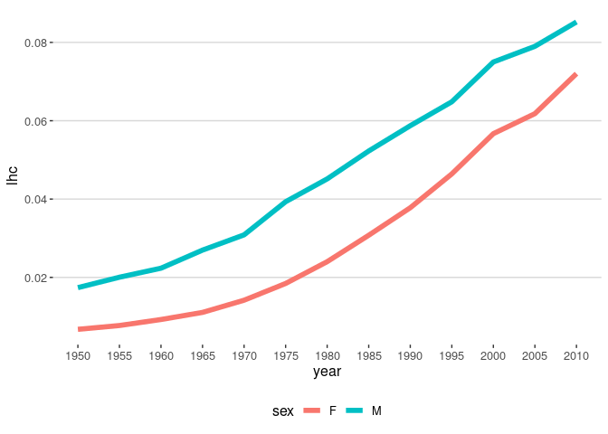<!-- -->

## Distribution des taux d’éducation supérieure complète des femmes et des hommes dans la population agée de plus de 15 ans, par pays.

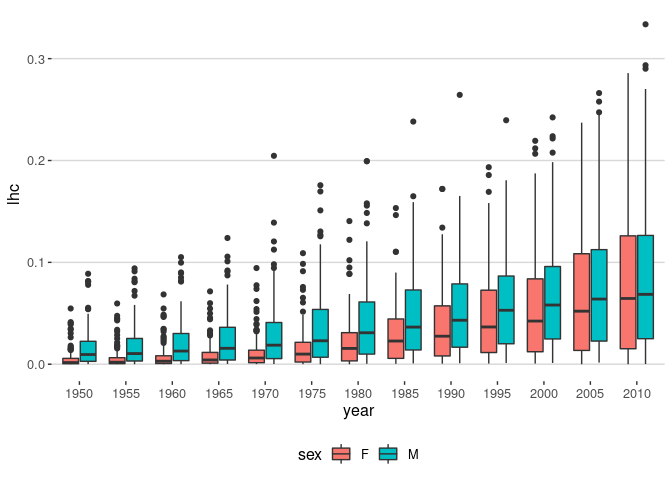<!-- -->

## Distribution des différence des taux d’éducation supérieure complète des femmes et des hommes dans la population agée de plus de 15 ans, par pays.

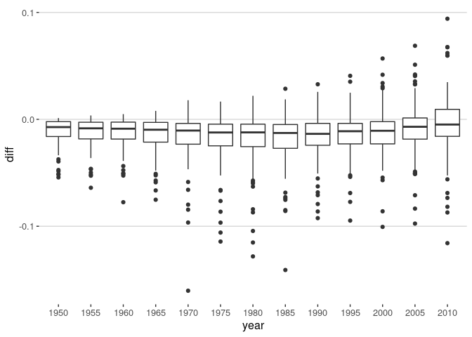<!-- -->

## Distribution des différence des taux d’éducation supérieure complète des femmes et des hommes dans la population agée de plus de 15 ans, par pays.

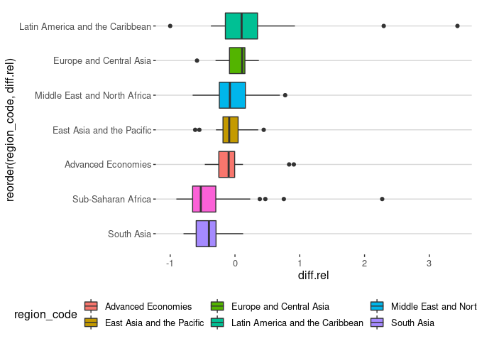<!-- -->

    ## Joining, by = "country"

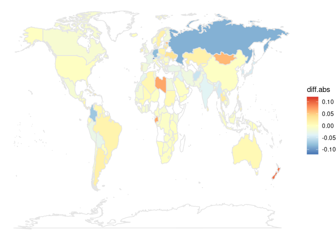<!-- -->
